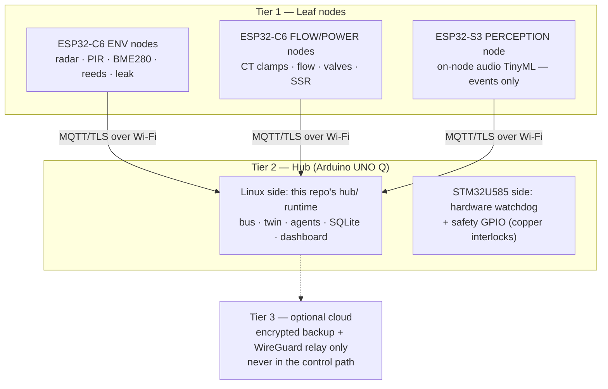
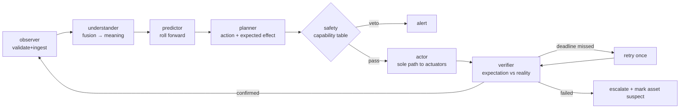

# DOMORA Architecture

Working reference for the code in this repo. The reasoning behind every choice
(and the rejected alternatives) lives in [docs/DOMORA_SPEC.md](docs/DOMORA_SPEC.md) §2–§17.

## Physical tiers

Safety behaviors are **distributed** (leaf reflexes work with the hub dead);
intelligence is **centralized** (the twin needs cross-node context).

## The cognitive loop (implemented in `hub/agents/`)

Agents never call each other. They communicate only through:

- **The twin** (`hub/twin/state.py`) — typed points `{value, t, source, confidence}`,
  staleness-aware. Silence is a signal.
- **The bus** (`hub/core/bus.py`) — MQTT-style topics, one contract for
  simulation and production:

| Topic | Direction | Meaning |
|---|---|---|
| `domora/<node>/<asset>/<point>` | node → hub | sensor reading |
| `domora/plan/action` | planner → actor | approved Action (with Expectation) |
| `domora/cmd/<asset>/<command>` | actor → node | actuation |
| `domora/act/dispatched` | actor → verifier | open the verification window |
| `domora/verify/confirmed` | verifier → all | loop closed |
| `domora/alert/<severity>` | anyone → human | veto / escalation |

## The expectation contract (the load-bearing idea)

Every `Action` (see `hub/agents/base.py`) carries an `Expectation`:
a **point**, a **predicate**, a human-readable **describe**, and a
**deadline**. The verifier holds the action open until the predicate is
satisfied by an *independent* sensor or the deadline passes. Outcomes:

- **confirmed** — model and world agree; loop closes silently.
- **retry (once)** — transient failure tolerated exactly once.
- **failed** — asset marked `suspect` in the twin, critical alert raised,
  human takes over. *A stuck valve is discovered the day it sticks.*

## Knowledge graph (`hub/config/house.json`)

Assets + typed edges (`feeds`, `senses`). `graph.upstream_shutoff(asset)`
walks `feeds` edges backwards to find the controllable valve isolating a
leak — causal response is a traversal, not an inference.

## What is deliberately absent

No LLM in the control loop, no RL, no cloud dependency, no per-agent
frameworks. The spec's §25 explains each exclusion; the short version is
that everything in the loop must be explainable after the fact and
functional with the internet cut.
