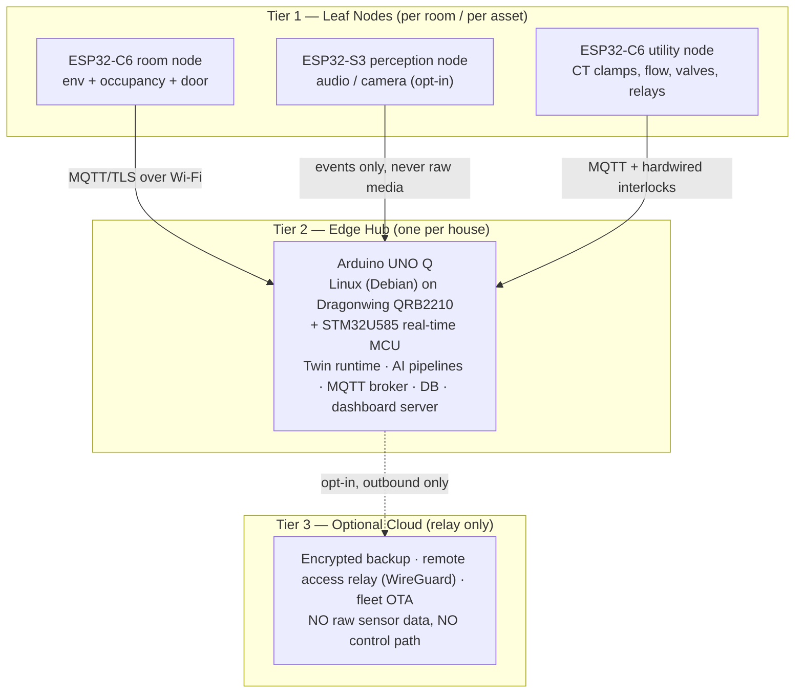
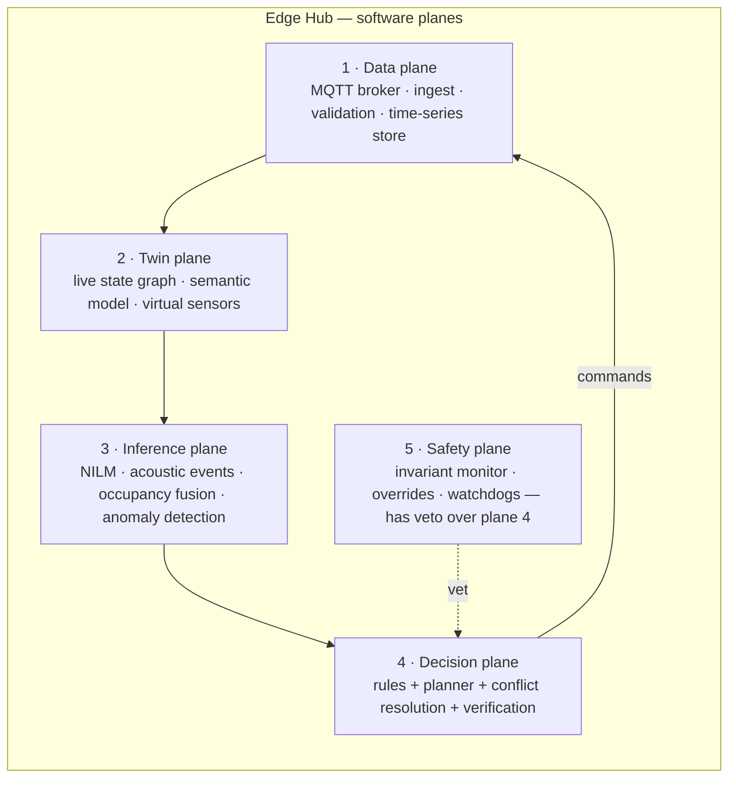
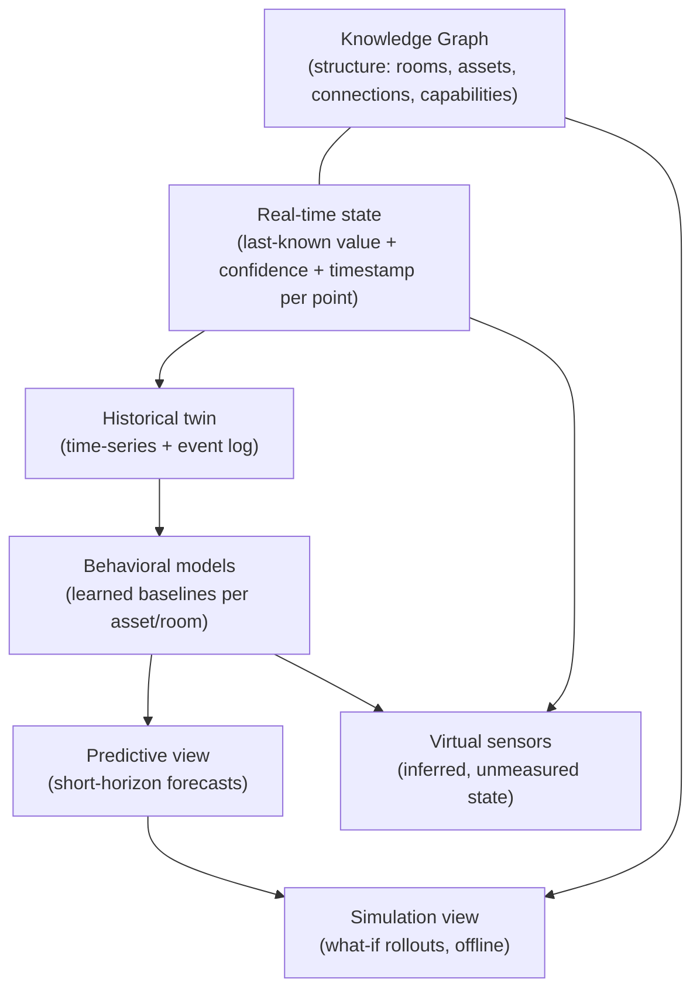
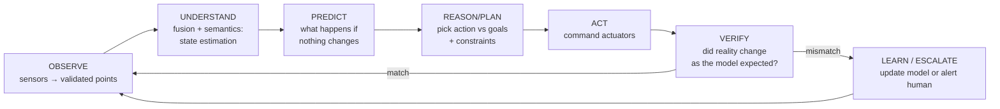
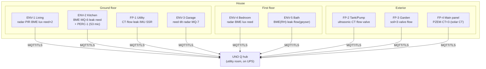
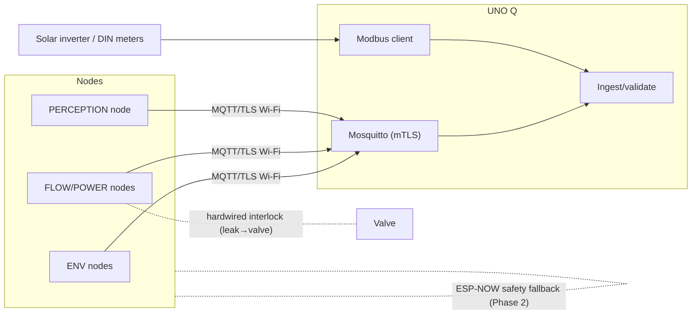
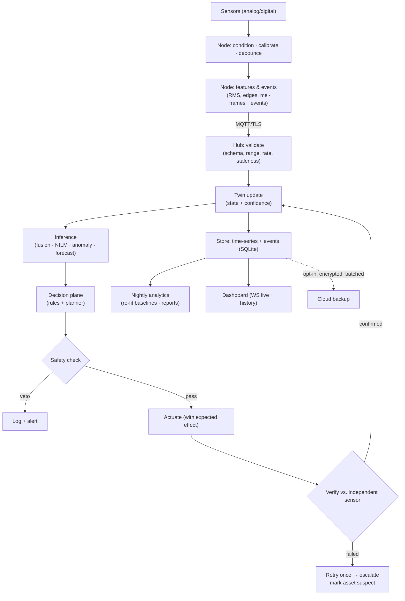
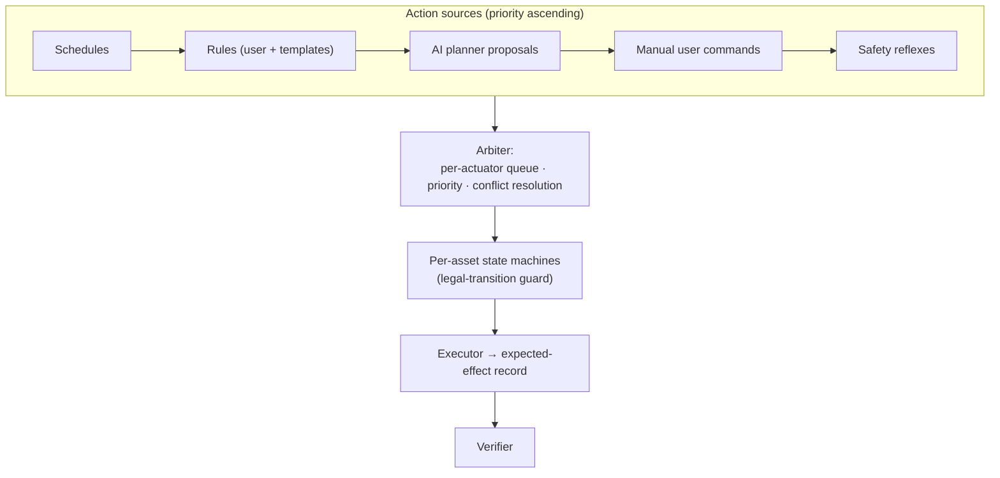

# DOMORA — Engineering Specification & Critical Design Review

**Digital Operating Model for Residential Awareness**
*A Physical AI Operating System built on a live residential Digital Twin*

| | |
|---|---|
| Document type | Systems engineering specification + critical design review |
| Intended use | Arduino Physical AI Challenge prototype · startup technical design doc · research proposal seed |
| Review stance | **Adversarial.** Every claim in the concept brief has been challenged. Where the original vision is over-scoped, this document says so and proposes the corrected architecture. |
| Date | July 2026 |
| Status | Draft for team review |

---

## How to read this document

This is not a cheerleading document. The team brief asked for critical evaluation, and the single most important finding is stated up front:

> **The Verdict.** DOMORA's core idea — a *closed-loop, verifying, predictive* model of a house running locally — is genuinely differentiated and demo-able. But the concept brief as written describes roughly **4 person-years of work** and conflates three products (a hackathon prototype, a commercial platform, and a research program). The winning move is a **thin vertical slice**: 3–4 sensor nodes, one hub, one live twin, and **two closed loops that visibly act and verify on stage**. Everything else in this document is the map for later phases — not the prototype.

Sections 1–24 present the full architecture as if building the commercial product, with design decisions, rejected alternatives, and trade-offs called out inline in **Decision** blocks. Section 25 then deliberately attacks the whole design and extracts the Minimum Viable Prototype.

---

# SECTION 1 — PROJECT OVERVIEW

## 1.1 Vision

Every house already *behaves* like a system — energy flows, water flows, heat moves, people move, machines age — but nobody can see the system. DOMORA's vision is a house that maintains a faithful, continuously-updated computational model of itself, and uses that model to anticipate rather than react: to know a pump is failing before it fails, that a tap is dripping before the bill arrives, that a room is drifting out of comfort before anyone reaches for a switch.

## 1.2 Mission

Build a **local-first Physical AI operating system** whose core abstraction is the Digital Twin, not the device. Devices come and go; the twin persists. The mission constraints, in priority order:

1. **Safety** — the system must never make a house less safe than a house without it.
2. **Privacy** — raw sensor data (especially audio/video) never leaves the premises by default.
3. **Autonomy without cloud** — full function with the internet cable cut.
4. **Explainability** — every autonomous action must be traceable to observed state + a stated reason.
5. **Affordability** — a mandatory tier deployable in an Indian home for less than the cost of a mid-range phone.

## 1.3 Objectives (measurable)

| Objective | Metric | Target (Phase 1 → Phase 3) |
|---|---|---|
| Twin fidelity | State sync latency, sensor→twin | < 2 s → < 500 ms |
| Anomaly detection | Precision on seeded faults (leak, stuck appliance) | > 80% → > 95%, < 1 false alarm/week |
| Energy insight | Appliance-level disaggregation accuracy (top 5 loads) | > 70% → > 90% F1 |
| Closed-loop verification | % of actuations verified by independent sensing | 100% for water/power actuations |
| Offline autonomy | Function with WAN down | 100% of control features |
| Privacy | Raw audio/video frames leaving LAN | 0 by default |

## 1.4 Innovation and novelty — an honest assessment

Claimed novelties, graded:

| Claim | Verdict | Why |
|---|---|---|
| "Digital twin of a house" | **Not novel** as a phrase — DT research on buildings is a decade old. **Novel in execution**: research twins are commercial BMS-scale, cloud-hosted, and open-loop (monitoring only). A *residential*, *edge-resident*, *actuating* twin is a real gap. |
| Closed-loop **verification** (act → sense → confirm) | **Genuinely differentiating.** No consumer platform verifies its own actuations against independent sensors. Google/Alexa fire a command and trust the ACK. This is the heart of "Physical AI" and the best demo moment. |
| Virtual sensors (inferring unmeasured state) | **Strong.** NILM (load disaggregation from one current clamp) is established research but absent from consumer smart homes; acoustic appliance monitoring likewise. Cheap hardware + inference = differentiation. |
| Predictive maintenance for home appliances | **Overclaimed for Phase 1.** Real predictive maintenance needs failure data you won't have. Ship *anomaly detection* (deviation from learned normal) and call it that; earn "predictive" later. See §14. |
| "Learns normal behavior" | Established technique (statistical + autoencoder baselines), but genuinely rare in consumer products, which are rule-based. Keep. |
| Local LLM reasoning | **Buzzword risk.** Useful only as an *interface* (explain state, translate intent→rules). It must never sit in the control loop. See §9.11. |

**The defensible one-sentence novelty:** *DOMORA is the first residential system where every autonomous action is planned against a live model and verified against independent physical evidence — a house that checks its own work.*

## 1.5 Comparison with existing systems

| | Google Home | Alexa | Apple Home | SmartThings | Home Assistant | Commercial BMS / DT research | **DOMORA** |
|---|---|---|---|---|---|---|---|
| Core abstraction | Device + voice | Device + skill | Device/scene | Device + routine | Entity + automation | Building model | **House model (twin)** |
| Intelligence locus | Cloud | Cloud | Hybrid | Cloud→edge (drifting local) | Local, rule-based | Cloud analytics | **Edge, model-based** |
| Works offline | Partially | Barely | Mostly | Partially | **Yes** | Varies | **Yes (by design)** |
| Learns baselines | Limited (Nest) | Limited | No | No | No (add-ons only) | Yes | **Yes, core** |
| Verifies actions | No | No | No | No | No | Rarely | **Yes, always** |
| Predicts / simulates | No | No | No | No | No | Yes (HVAC-scale) | **Yes, house-scale** |
| Appliance-level energy w/o per-plug HW | No | No | No | No | No | N/A | **Yes (NILM)** |
| Privacy of audio | Cloud ASR | Cloud ASR | On-device (partial) | Cloud | Local | N/A | **Local-only, non-speech events** |
| Open / hackable | No | No | No | Partially | **Yes** | No | Yes (planned) |

**Against Home Assistant specifically** — this is DOMORA's most important comparison, because HA is the obvious "why not just use…" question and judges will ask it. HA is a *device integration and automation hub*: world-class at connecting 2,000+ integrations, fundamentally rule-based, with no model of the house. It does not know that the kitchen and living room share a wall, that the pump feeds the tank, that a flow reading with all taps closed is physically impossible. DOMORA's honest positioning: **not an HA competitor but an intelligence layer that could sit on top of HA** (consume its entity states via MQTT) while owning the twin, the learning, and the verification loop. This positioning also de-risks the integration problem — see §25.

**Against digital-twin research** (building-scale DT literature, NVIDIA Omniverse-class industrial twins): those systems assume BIM models, commercial sensor density, cloud compute, and professional commissioning. None target the residential price point, none run on a 2 GB edge device, and almost all are *digital shadows* (physical→digital only). DOMORA's research contribution is exactly the neglected quadrant: **low-cost, self-commissioning, bidirectional, edge-resident residential twins.** See §21 for gap analysis.

---

# SECTION 2 — SYSTEM ARCHITECTURE

## 2.1 Architectural philosophy and the first big correction

The brief lists 13 layers. Thirteen layers is an org chart, not an architecture — several of them (Physical AI / Reasoning / Automation / Knowledge) describe *aspects of the same software process* and drawing them as stacked layers invites building 13 services on a 2 GB board. The corrected architecture keeps the *conceptual* 13-layer view for communication (it is genuinely useful for the pitch and the docs) but implements them as **three physical tiers and five software planes**.

### Physical tiers

**Decision — two tiers of compute, not three.** The brief's "every room becomes an intelligent node" tempts a per-room hub tier (e.g., an RP2040 aggregator per room). Rejected: it triples cost and failure points for zero benefit at house scale. A house produces perhaps 50–200 sensor messages/second peak; a single hub handles that with >90% headroom. Room-level "intelligence" lives in the leaf firmware (local reflexes + TinyML) and in per-room twin partitions on the hub — not in extra hardware.

**Decision — hub survives node loss; nodes survive hub loss.** Each leaf node keeps a minimal reflex layer (e.g., leak sensor → close valve; smoke → sound local buzzer) that functions with the hub dead. This is the single most important architectural rule in the document: *safety behaviors are distributed; intelligence is centralized.*

### Software planes on the hub

## 2.2 The thirteen conceptual layers — what each one actually is

| # | Layer | What it really is | Implementation |
|---|---|---|---|
| 1 | **Physical** | The house itself: wiring, plumbing, appliances, structure. Design consideration: sensor/actuator mounting, mains isolation, valve placement. | §7, §16 |
| 2 | **Sensor** | Distributed leaf nodes, each a bundle of transducers + MCU. Owns signal conditioning, calibration, local buffering, reflexes. | §8 |
| 3 | **Communication** | Wi-Fi + MQTT/TLS now; Thread/Matter later; ESP-NOW for battery leaves; hardwired lines for safety interlocks (never wireless). | §11 |
| 4 | **Edge** | The UNO Q hub: Linux side runs services, MCU side (STM32U585) runs the hardware watchdog + safety I/O. | §7, §9 |
| 5 | **Physical AI** | Not a layer — the *loop*: observe→understand→predict→plan→act→verify→learn, implemented across planes 2–5. | §4 |
| 6 | **Digital Twin** | The state graph + semantic model + history + predictive models. The system's shared memory; every other plane reads/writes it. | §3 |
| 7 | **Knowledge** | The ontology: rooms, assets, connections (pipe/wire/airflow topology), capabilities. Lightweight property graph in SQLite, Brick-schema-inspired. | §3.7, §13 |
| 8 | **Reasoning** | Deterministic planner + learned models. Explicitly *not* an LLM in the loop. | §4, §15 |
| 9 | **Automation** | The execution engine: rules, schedules, state machines, priorities, conflict resolution. | §15 |
| 10 | **Safety** | Invariant monitors + hardware interlocks + certified standalone life-safety devices. Vetoes everything above it. | §16 |
| 11 | **Cloud** | Optional, outbound-only: backup, remote relay, fleet OTA. Never in the control path. | §17 |
| 12 | **Visualization** | Web dashboard (Three.js twin view + telemetry), served from the hub. | §10, §18 |
| 13 | **Developer** | MQTT topic contract, REST/WebSocket API, simulation harness, node SDK (firmware template). | §10.5 |

## 2.3 End-to-end flow example (grounding the architecture)

*Washing machine bearing degradation:* utility-node CT clamp streams the machine's current waveform → hub extracts per-cycle features (spin-phase current spectrum) → anomaly model flags rising harmonic energy vs. the machine's learned baseline → twin marks asset `washer.health = degrading` with evidence → decision plane raises a maintenance prediction (no actuation) → dashboard timeline shows the drift over 3 weeks → user confirms bearing noise → label feeds back into the model. No cloud, no camera, one ₹300 clamp.

*Leak:* flow sensor shows 2 L/min at 03:00 with `occupancy = all asleep` and all known fixtures' expected flow = 0 → twin's water-balance virtual sensor flags impossible state → decision plane closes motorized valve → **verification: flow must fall to 0 within 10 s; if not, escalate alarm** (valve failed or bypass leak) → event logged with full causal chain. This is the flagship demo loop (§24).

---

# SECTION 3 — DIGITAL TWIN ARCHITECTURE

## 3.1 The correction first: one twin, six views — not six twins

The brief lists Real-time / Semantic / Behavioral / Predictive / Simulation / Historical twins as if they were separate systems. Building six twin subsystems is how the project dies. The correct model: **one canonical state store with six views over it**, sharing one identity scheme (the knowledge graph's asset IDs) and one clock.

## 3.2 Real-time twin (the state core)

A typed key-value graph: every *point* (measurable or commandable property of an asset) holds `{value, unit, timestamp, source, confidence, staleness_policy}`. Confidence matters: a radar-based occupancy value at 0.95 and a CO2-inferred one at 0.6 fuse differently. Staleness policy makes silence meaningful — a node that stops reporting flips its points to `stale`, which is itself an anomaly signal (dead node, Wi-Fi hole, power loss in that room).

**Decision — in-memory state with write-through journaling, not a database as the live store.** The live twin is a few thousand points; it lives in RAM (a Python/Rust process on the hub) and journals changes to SQLite. Querying a DB for every control decision adds latency and failure modes for nothing.

## 3.3 Semantic twin (meaning)

Raw: `node7/adc3 = 512`. Semantic: `kitchen.sink.flow = 4.2 L/min, feeds: kitchen.sink, fed_by: main_line`. The semantic layer is what lets reasoning generalize ("close the valve *upstream of* the leak"). Implemented as the knowledge graph (§3.7) binding every point to an asset, a location, and physical connections.

**Decision — adapt Brick Schema concepts, don't adopt it wholesale.** Brick (the academic building-ontology standard) is commercial-HVAC-centric and RDF/SPARQL tooling is too heavy for the hub. We keep its core insight — *points belong to equipment, equipment to locations, connected by typed relationships (feeds, hasPart, isUpstreamOf)* — as a property graph in SQLite. This is also a publishable contribution: a residential ontology profile (§21).

## 3.4 Behavioral twin (learned normal)

Per asset and per room: expected daily load shapes, appliance current signatures, water-use event distributions, occupancy rhythms, thermal response (how fast does the bedroom heat/cool given outdoor temp — a 1R1C thermal model fitted from history). These baselines are the reference against which "anomaly" is defined. Cold-start honesty: the system needs **2–4 weeks** of data before baselines are meaningful; during that period it runs in observe-and-suggest mode only. Say this in the pitch before a judge asks.

## 3.5 Predictive twin

Short-horizon forecasts written back as future-dated points: tank empty in ~6 h at current draw; bedroom hits 31 °C by 15:00 without intervention; tomorrow's solar yield from weather + panel history. Prediction here is mostly *simple models done well* — exponential smoothing, fitted RC thermal models, regressors — not deep learning. Deep models are reserved for perception (audio, NILM), where they earn their cost.

## 3.6 Simulation twin

Offline what-if: replay history with a modified policy ("what would pre-cooling at 13:00 have cost/saved?"), Monte-Carlo tank-sizing, rule regression testing before deploying a new automation. **Decision — simulation runs on a laptop/CI against exported twin data, not on the hub.** The hub has no spare compute and no need: simulation is a development-time and analysis-time activity. This also gives the developer layer its testing story: every new automation rule must pass replay-simulation against 30 days of real history without safety violations.

## 3.7 Knowledge graph

Nodes: `House → Floors → Rooms → Assets → Points`, plus infrastructure chains (`Mains → RCD → Circuit → Socket → Appliance`; `Municipal/Tank → Pump → Pipe → Fixture`). Edges: `contains, feeds, isUpstreamOf, powers, senses, actuates, adjacentTo`. ~500 nodes for a full house — trivially small; the value is in the edge semantics, which enable causal queries: *"what can I shut off to isolate this leak with least disruption?"* is a graph traversal, not an AI problem.

## 3.8 Virtual sensors — the highest-leverage idea in the project

Inferred quantities with no dedicated hardware:

| Virtual sensor | Inferred from | Replaces |
|---|---|---|
| Per-appliance power | One CT clamp at panel + NILM | ₹700 × N smart plugs |
| Water balance / hidden leak | Tank level ± flow integration vs. fixture events | Per-pipe flow meters |
| Room occupancy count (coarse) | Radar + PIR + CO2 slope + door events, fused | Cameras |
| Appliance cycle state (washer rinsing vs spinning) | Current signature + acoustic signature | Smart appliances |
| Window open (unsensed windows) | Temp/humidity transient + outdoor delta | Extra contact sensors |
| Pump health | Current draw vs. flow delivered (efficiency drift) | Vibration sensor kits |

Every virtual sensor carries confidence and shows its evidence in the UI — this is both the explainability story and the demo "wow" (the system *knows* the kettle is on, and can show you the current step it saw).

## 3.9 Digital shadow vs. twin, and the digital thread

*Shadow* = physical→digital sync only (monitoring). *Twin* = bidirectional: the model also drives the physical (actuation) and the physical verifies the model (closed loop). Most "digital twin" products are shadows; DOMORA's claim to the word "twin" **is** the verification loop. The *digital thread* is the lifetime record per asset: installed date, baselines, anomalies, maintenance events, model versions — the asset's biography, which is what makes long-horizon health assessment possible and (Phase 4) makes an appliance's history portable to insurers/service techs with owner consent.

---

# SECTION 4 — PHYSICAL AI

## 4.1 The loop

Each stage, concretely:

- **Observe** — ingest, validate (range/rate-of-change checks), timestamp, de-noise. Bad data rejected *here*, with the rejection itself logged as a sensor-health signal.
- **Understand** — fuse multi-sensor evidence into semantic state (occupancy estimation, appliance identification, water-balance closure). This is state estimation, the least glamorous and most valuable stage.
- **Predict** — roll the behavioral models forward over minutes-to-hours.
- **Reason/Plan** — deterministic planner: given goals (comfort, cost, safety) and the predicted trajectory, select actions. Constraint-checked against the safety plane *before* execution.
- **Act** — issue commands with an explicit **expected effect**: `(point, expected_direction, magnitude, deadline)`.
- **Verify** — the differentiator. Every command's expected effect is checked against independent sensing. Three outcomes: *confirmed* (close loop), *failed* (actuator fault → retry once → escalate + mark asset suspect), *unexpected side-effect* (model wrong → flag for learning). A stuck valve is *discovered the day it sticks, not the day of the flood.*
- **Learn** — nightly: baselines re-fit, thresholds recalibrated, user feedback (accepted/dismissed alerts) folded in as labels.

## 4.2 How Physical AI differs from adjacent things (the judge's question)

| | Has a world model? | Acts on the world? | Verifies its actions? | Learns the specific site? |
|---|---|---|---|---|
| **LLMs** | Text-statistical, not grounded; no persistent state, no sensors, no time | No | No | No |
| **IoT** | No model — telemetry pipes | Sometimes (remote control) | No | No |
| **Rule automation** (incl. HA) | No — stateless triggers | Yes | No | No |
| **Robotics** | Yes (ego-centric, one body) | Yes | Yes | Sometimes |
| **DOMORA Physical AI** | Yes — site-specific twin | Yes | **Yes, always** | **Yes — the house is the dataset** |

The crisp framing: **DOMORA treats the house as a robot** — a robot with distributed senses, slow actuators, and people living inside it. Robotics discipline (state estimation, planning under uncertainty, closed-loop control, safety envelopes) applied to a building. That's what "Physical AI" means here, and why it is neither an LLM wrapper nor IoT rebranded.

## 4.3 Where an LLM legitimately fits

Interface, not intellect: translating "warn me if the geyser is left on when we leave" into a rule the deterministic engine executes; narrating twin state ("water use is 30% above your Friday normal; the evidence is…"). Runs on-hub if a small model fits (§9.11), else the feature degrades gracefully to forms and templated text. **The control loop must be fully functional with the LLM deleted** — that sentence goes in the pitch.

---

# SECTION 5 — ROOM INTELLIGENCE

Format per room: hardware, intelligence, the room's twin & state machine, safety, and the honest cut-list (what the brief implied that we reject or defer). Sensor part choices and prices are justified in §6; placement in §8.

## 5.1 Living Room — *comfort + occupancy anchor*

- **Sensors:** LD2410 mmWave radar (presence incl. still humans) + PIR (fast trigger, radar disambiguation), BME280 (T/RH/P), SGP40 (VOC), light sensor (VEML7700), window/door reed contacts, INMP441 mic (opt-in acoustic events: glass break, alarm sounds, TV-on).
- **Actuators:** fan/AC via IR blaster + smart relay; lights via relay/dimmer.
- **Intelligence:** occupancy fusion (radar+PIR+CO2 slope+door), thermal comfort loop using the fitted room RC model — pre-act, don't react: start cooling *before* the 17:00 occupancy pattern the behavioral twin has learned.
- **State machine:** `EMPTY → OCCUPIED_ACTIVE → OCCUPIED_STILL → EMPTY(pending, 10 min radar-confirmed)`. The `OCCUPIED_STILL` state is why radar is mandatory — PIR-only systems turn lights off on reading humans, the canonical smart-home failure.
- **Verify example:** commanded AC on → expect supply-side current signature at panel within 60 s AND temp slope inflection within 10 min; else flag (AC fault, IR miss, or compressor issue).
- **Cut:** camera. Occupancy is achievable without it; the privacy cost in the *most-lived-in room* outweighs marginal accuracy.

## 5.2 Kitchen — *highest event density, highest fire/gas risk*

- **Sensors:** MQ-6 LPG sensor (mounted LOW — LPG sinks; this placement detail is a demo-able competence signal), heat detector (not smoke — cooking fumes make smoke detectors cry wolf in Indian kitchens), BME280, flow sensor on sink line, current signature of fridge/microwave/kettle via NILM, leak probes under sink.
- **Actuators:** exhaust fan relay; **LPG solenoid shutoff on the regulator line**; sink valve.
- **Intelligence:** acoustic + power fusion for appliance states; fridge compressor health (duty-cycle drift = failing door seal or gas leak — a genuinely useful prediction from one clamp); "stove on + kitchen empty > N min" hazard rule.
- **Safety:** gas response is a **leaf-node reflex**: MQ-6 threshold → close LPG solenoid + buzzer + exhaust on, *hub or no hub*. Hub adds context (notify, log, verify solenoid closed via gas decay curve). MQ-x sensors drift and cross-react (§8); the certified detector requirement of §16 stands regardless.

## 5.3 Bedroom — *quiet intelligence, minimal footprint*

- Radar (presence + LD2410's coarse motion → sleep stillness proxy), BME280, light, window contact. **No microphone, no camera — hard line.** Night mode: safety-only automations, all notifications deferred, lights ramp dim-red if bathroom trip detected. CO2 (if premium SCD40 fitted): ventilation nudge when sleeping CO2 > 1200 ppm — a real, felt comfort win.
- **Cut:** sleep-quality scoring. Wearables do it better; radar-based sleep staging is a research project by itself.

## 5.4 Bathroom — *humidity, water, falls*

- Humidity spike detection (shower) → exhaust fan auto with learned run-on time; leak probes at floor trap; flow on geyser line; **geyser element health**: power draw vs. temperature rise time drifting = scale buildup — a strong India-relevant prediction. Presence via radar (fall-relevant: `OCCUPIED_STILL` on the *floor zone* for > N min at night → gentle check-in escalation). No mic, no camera, obviously.

## 5.5 Utility Room — *the machines live here; richest predictive ground*

- Washer current-signature health (§2.3 example), water inlet flow, leak probes, vibration (MPU6050 on washer chassis — spin imbalance / bearing wear), iron-left-on detection (sustained resistive load + room empty).

## 5.6 Garage — *security perimeter + vehicle*

- Door state (reed + tilt), radar presence, CO alert if any combustion appliance/vehicle idling (MQ-7 class + certified CO alarm), door-left-open-at-night rule with verified auto-close *only if* the door has a certified safety edge/beam — otherwise notify-only. **Never auto-close a garage door without an entrapment sensor. Non-negotiable.**

## 5.7 Garden — *water discipline*

- Soil moisture (capacitive, not resistive — resistive probes corrode in weeks), valve per zone, flow verification of every irrigation run (flow while valve commanded closed = stuck valve or burst line; no flow while open = clog/empty tank). Irrigation planned from soil model + weather forecast (skip before rain). **Cut:** per-plant sensing, camera plant-health — Phase 5 toys.

## 5.8 Water Tank + Pump — *the flagship subsystem for India*

- Ultrasonic level (AJ-SR04M, waterproof probe class), pump current clamp, pump-line flow.
- **The trio enables real diagnostics:** pump ON + current normal + no level rise = **dry run or broken impeller → cut pump immediately** (dry-run destroys seals in minutes); level falling with all fixtures idle = tank-side leak/overflow; efficiency (litres-raised per kWh) trending down = impeller wear or suction blockage — *this is honest predictive maintenance from ₹800 of sensing*.
- Level forecast → "water ends ~18:30 today" → auto-refill scheduled to solar surplus window or off-peak.
- State machine: `IDLE → FILLING(verify: level slope > threshold) → FULL(cutoff, verify: flow=0) → FAULT(dry-run | no-rise | overflow)`.

## 5.9 Main Electrical Panel + Solar — *the house's pulse*

- 3× SCT-013 CT clamps (or PZEM-004T modules) on mains ± phases, one on solar feed; voltage monitoring (brownout/surge log — very India-relevant); this node feeds NILM for the whole house. Solar: yield vs. irradiance-normalized baseline → "panels 12% below expected — cleaning due" (dust soiling is the dominant, easily-predicted solar fault in India). Load-shifting advice (later: control) into solar surplus. **All panel work behind an RCD, installed by an electrician; the node is sensing-first, and any mains actuation goes through certified contactors (§16).**

---

# SECTION 6 — BILL OF MATERIALS (Indian pricing, July 2026 street prices — verify before purchase; hobby-market prices swing ±30%)

## 6.1 Tier M — Mandatory (competition prototype + minimum useful deployment)

| Item | Qty | Unit ₹ | Total ₹ | Why this part (and what was rejected) |
|---|---|---|---|---|
| Arduino UNO Q (hub) | 1 | ~5,000 | 5,000 | Competition requirement + genuinely fits: Linux (Debian, 2 GB) for twin/AI + STM32U585 for real-time safety I/O on one board. Rejected: Pi 5 (better specs, but not Arduino — see §7.1). |
| ESP32-C6 DevKit (leaf nodes) | 4 | 550 | 2,200 | Wi-Fi 6 + Thread/Zigbee + BLE on one chip = Matter-proof without re-hardware. Rejected: ESP32-WROOM (older, no Thread), ESP8266 (no crypto headroom, dead-end). |
| ESP32-S3 DevKit N8R8 (perception node) | 1 | 850 | 850 | Vector instructions + 8 MB PSRAM for TinyML audio. C6 can't run meaningful audio models. |
| SCT-013-030 CT clamp | 3 | 300 | 900 | Non-invasive, clamp-on = no rewiring for the demo. Rejected as sole solution: PZEM-004T (adds true kWh + voltage but needs line connection). Buy 1 PZEM too (₹700) for calibration. |
| PZEM-004T v3 | 1 | 700 | 700 | Reference-grade energy metering + voltage/frequency on one circuit. |
| YF-S201 flow sensor | 2 | 250 | 500 | Cheap hall-effect flow. Known ±10% accuracy — fine for event detection and balance checks, not billing. Rejected: ultrasonic clamp-on flow (₹8k+, Phase 3). |
| Motorized ball valve, ½″ 12 V (e.g., CWX-15) | 1 | 1,400 | 1,400 | Full-bore, low leak-pressure-drop, position feedback wires. Rejected: solenoid valve (₹400) — fails energized/hot, water-hammer, no position feedback; acceptable only for irrigation. |
| BME280 module | 4 | 300 | 1,200 | T/RH/P, well-characterized, I2C. Rejected: DHT22 (slow, flaky one-wire protocol, poor RH accuracy) — the ₹150 saved isn't worth demo risk. |
| LD2410C mmWave radar | 3 | 400 | 1,200 | Still-presence detection ~₹400 — the single best price/perception ratio in the whole BOM. Rejected: PIR-only (loses still humans), LD2450 (tracking, ₹900 — premium tier). |
| PIR HC-SR501 | 3 | 90 | 270 | Fast wake + radar cross-check. |
| Reed contacts (door/window) | 6 | 60 | 360 | Boring, reliable, essential ground truth for occupancy fusion. |
| Water leak probe pairs | 4 | 80 | 320 | Passive probes into leaf-node ADC. |
| INMP441 I2S mic | 2 | 280 | 560 | Digital mic → clean audio into S3 TinyML. Rejected: analog MAX4466 (noise floor too high near Wi-Fi). |
| MQ-6 (LPG) + MQ-7 (CO) | 1+1 | 160 | 320 | Trend/trigger sensing only — **not** life-safety (§16.8). |
| AJ-SR04M waterproof ultrasonic (tank) | 1 | 350 | 350 | Tank level. Rejected: pressure transducer (better, ₹1.2k, premium tier). |
| MPU6050 IMU | 1 | 150 | 150 | Washer/pump vibration signatures. |
| VEML7700 lux | 2 | 250 | 500 | Proper lux (not LDR guesswork) for lighting loops. |
| 5 V relay boards (opto) 2ch | 3 | 130 | 390 | Loads < 5 A. Anything bigger → contactor via electrician. |
| SSR 25 A + heatsink (geyser/pump) | 1 | 450 | 450 | Silent, arc-free switching of resistive loads; must be behind thermal + RCD protection. |
| Buzzers, LEDs, level shifters, wire, connectors | — | — | 1,500 | Node build-out. |
| PSUs: 5 V/3 A ×5, 12 V/2 A ×2 (valve) | 7 | 250 avg | 1,750 | One PSU per node; no daisy-chaining across rooms. |
| Enclosures (ABS IP54 where wet) + DIN bits | — | — | 1,200 | §7.8. |
| **Tier M total** | | | **≈ ₹22,000** | Under the "mid-range phone" objective. |

## 6.2 Tier R — Recommended (adds real sensing depth)

| Item | Qty | ₹ | Why |
|---|---|---|---|
| SCD40 true CO2 | 2 | 2,200 ea | VOC sensors (SGP40) *estimate* CO2; SCD40 measures it (photoacoustic NDIR). Needed for credible ventilation + occupancy-slope inference. Bedroom + living room. |
| SGP40 VOC | 2 | 800 ea | Cooking/chemical events, air-quality index. |
| Motorized valve ×2 more (LPG line ½″ + garden) | 2 | 1,400 ea | Extends verified-shutoff to gas and irrigation. |
| Certified standalone smoke + CO + LPG alarms | 3 | 1,200 avg | **Non-negotiable if any autonomy ships** (§16.8). Listed here only because the bare competition demo can run without live gas. |
| Capacitive soil moisture ×3, tilt sensor, more reeds/leak probes | — | ~1,500 | Garden + garage coverage. |
| UPS/battery for hub (18650 pack + BMS or mini-UPS) | 1 | 2,000 | Hub must outlive a power cut (§16.6). |
| **Tier R adds** | | **≈ ₹15,000** | |

## 6.3 Tier P — Premium

MLX90640 thermal array (₹6,500 — hotspot detection at panel: genuinely valuable, deferred for cost), LD2450 tracking radar (₹900), OV2640/S3-CAM entrance-only camera (₹1,100), pressure transducers for tank + line pressure (₹1,200 ea — line-pressure transients detect leaks *between* flow meters), Zigbee smart plugs ×4 for NILM ground-truth labelling (₹1,100 ea), 8″ wall tablet for dashboard (₹9,000). **≈ ₹25,000.**

## 6.4 Tier F — Future (Phase 3+)

Ultrasonic clamp-on flow, per-circuit DIN energy meters (Modbus), Thread border router, custom PCBs (§7.7), N100 mini-PC hub for multi-model AI (₹14,000), LoRa for a farm/outbuilding scenario.

**Honest total: full-house recommended build ≈ ₹37k; with premium ≈ ₹62k.** The demo needs only a ~₹15k subset of Tier M (see §25.6).

---

# SECTION 7 — HARDWARE PLATFORM

## 7.1 Hub: Arduino UNO Q — the right call, with eyes open

The UNO Q pairs a Qualcomm Dragonwing QRB2210 (4× Cortex-A53, 2 GB LPDDR4, Debian Linux) with an STM32U585 (Cortex-M33, TrustZone) on one board. For DOMORA it is almost thematically perfect: the Linux side runs the twin/broker/DB/dashboard; the M33 side is the always-on safety micro (hardware watchdog, interlock GPIO, last-resort reflexes) that keeps working if Linux wedges.

Honest limits: 2 GB RAM caps concurrent AI (fine: our models are small — §9); A53 cores are modest (no local LLM beyond tiny models; no problem — LLM is optional garnish); eMMC is small (log rotation + retention policy from day one, §12.9); the board is new, so community answers are thin — budget debugging time. Fallbacks if the hub chokes: demote UNO Q to safety-I/O + broker role and move AI to a laptop *on the LAN* (still "local-first," and an acceptable demo posture if declared).

## 7.2 Leaf MCU choices

| | ESP32-C6 | ESP32-S3 | RP2040/2350 | STM32 (G0/F4) |
|---|---|---|---|---|
| Radio | Wi-Fi 6, **Thread/Zigbee**, BLE5 | Wi-Fi 4, BLE5 | None (Pico W: Wi-Fi 4) | None |
| AI capability | Trivial TinyML | **Good (vector ops, PSRAM)** | Modest | Modest |
| Crypto/secure boot | Yes | Yes | Weak (2040) / OK (2350) | Yes |
| Ecosystem for this team | Arduino/ESP-IDF, huge | Same | Good | Steep |
| Verdict | **Default leaf node** | **Perception (audio/cam) nodes** | Rejected: radio-less or Wi-Fi-4-only; no Thread path | Rejected as leaf: no radio, slower iteration. Its natural role (hard-real-time safety) is already filled by the UNO Q's STM32U585. |

**Decision: one firmware, two targets (C6, S3), config-driven roles.** Five different MCU families (as the brief implies) means five toolchains and five OTA pipelines — a maintenance tax with zero user value.

## 7.3 Raspberry Pi

Not in the competition build (Arduino challenge; UNO Q covers the role). In Phase 2/3, Pi 5 4 GB (~₹6.5k) or an N100 box becomes the recommended commercial hub — 2–4× the compute per rupee. The software must therefore be **portable by construction**: everything on the Linux side runs in containers with no UNO-Q-specific dependencies outside a thin hardware-abstraction service.

## 7.4 Power architecture

Per-node local 5 V supply from the nearest socket (good wall-wart, not phone chargers — they brown out on Wi-Fi TX bursts; this is the #1 cause of "mystery" ESP32 resets). 1000 µF bulk cap across node input rails. Hub on mini-UPS (≥ 4 h). Valve/actuator 12 V rails separate from logic rails, common ground, flyback protection. Battery leaf nodes (reed/leak only) deferred: mains-powered everywhere is fine for prototype and honest about it — battery-node engineering (deep sleep, ESP-NOW, months-on-a-cell) is its own project (§25.5).

## 7.5–7.9 PCB, enclosures, mechanics, 3D printing

- **Phase 1: no custom PCB.** Dev boards + screw-terminal adapter shields + JST leads. A custom PCB before the sensor set stabilizes is money burned twice. Phase 2: one **carrier PCB** (C6 module + terminals + PSU + protection) reused across node types via stuffing options.
- Enclosures: ABS project boxes; IP54/65 for bathroom/garden/tank; cable glands; **printed internal mounting trays, not printed outer enclosures** for anything near mains or weather (PLA creeps and UV-degrades; PETG/ASA acceptable but bought boxes are cheaper than reliable prints at qty < 100).
- 3D printing where it shines: sensor brackets (radar aim matters — §8), CT-clamp strain reliefs, tank-probe mounts, dashboard stand, and *the demo house model* (§24) — a 2-room dollhouse rig with real plumbing loop and real loads is the best mechanical investment in the whole project.
- Mains discipline: anything > 24 V lives in a separate, labelled, electrician-installed enclosure with contactor/RCD; DOMORA's relays switch the contactor coil, never the load directly.

---

# SECTION 8 — SENSOR NETWORK DESIGN

## 8.1 Node taxonomy (three node types, not twenty)

| Node type | HW | Fitted sensors (stuffing options) | Rooms |
|---|---|---|---|
| **ENV node** | C6 | BME280, radar, PIR, lux, reed ×2, leak ADC ×2, buzzer | Living, bed, bath, kitchen(+MQ-6), garage(+MQ-7, tilt) |
| **FLOW/POWER node** | C6 | CT ×3 / PZEM, flow ×2, valve driver, SSR/relay, IMU | Panel, utility, tank, garden |
| **PERCEPTION node** | S3 | INMP441, (opt) cam, PSRAM models | Kitchen/utility shared wall; entrance (opt) |

## 8.2 Placement rules that decide whether the data is usable

- **Radar (LD2410):** 1.8–2.2 m height, aimed across the room's occupied zone, **never at a fan or window curtain** (motion false-positives) and not through the wall at the neighbour's corridor (it penetrates gypsum). Printed angled bracket = repeatable aim.
- **BME280:** interior wall, 1.2–1.5 m, away from direct sun, supply-air draughts, and ≥ 30 cm from any warm electronics *including its own node's PSU* — self-heating reads +1–2 °C and silently poisons the thermal model. Probe on a 20 cm lead if boxed together.
- **MQ-6 (LPG):** 30 cm above floor near the cylinder/hob (LPG is heavier than air). **MQ-7 (CO):** breathing height. MQ-x need 24–48 h burn-in and drift with humidity — treat as *trend + threshold* sensors, calibrate against the certified alarm's response, never as the sole safety trigger.
- **CT clamps:** one conductor only (clamping the whole cable = fields cancel = zero reading — the classic first-day mistake), burden resistor at the node end, twisted-pair leads.
- **Flow (YF-S201):** straight pipe run ≥ 10× diameter upstream, horizontal, arrow with flow; calibrate with a bucket + kitchen scale (₹0, ±2%).
- **Ultrasonic tank probe:** centered, away from inlet turbulence; add a stilling tube (₹40 PVC pipe) — it converts a noisy ±4 cm signal into ±0.5 cm.
- **Mic:** kitchen/utility shared placement hears both rooms' appliances; never in bedrooms/bathrooms (policy, not just placement).
- **Leak probes:** lowest point of the drip zone (under trap, behind washer), probes 2 mm above floor to avoid condensation false alarms.

## 8.3 House node map

**Cross-validation is designed in, not accidental:** panel CT vs. sum of NILM estimates (energy balance); tank level derivative vs. pump flow (water balance); radar vs. PIR vs. CO2 (occupancy). Redundancy through *physics closure*, not duplicate sensors — cheaper and it also catches sensor faults, which duplicate sensors of the same failing type do not.

---

# SECTION 9 — EDGE AI

## 9.1 Pipeline placement — compute where the data is cheap to move from

| Stage | Where | Why |
|---|---|---|
| Sampling, filtering, calibration | Leaf MCU | Raw waveforms are expensive to ship; features are cheap. |
| Feature extraction (RMS/harmonics of current @ 1–5 Hz features; audio mel-spectrogram frames; radar presence) | Leaf MCU | A CT waveform at 2 kHz stays on-node; 5 features/s go to the hub. |
| Event classification (audio events, appliance on/off edges) | Leaf (S3 TinyML) / hub | S3 runs a small audio CNN locally → publishes *events*, never audio. Privacy is enforced by architecture, not policy. |
| Fusion, NILM disaggregation, anomaly scoring, forecasting | Hub | Needs cross-node context = the twin. |
| Training / re-fitting | Hub (nightly, small models) + laptop (heavy) | 2 GB hub re-fits statistical baselines fine; CNN training is offline. |

## 9.2 NILM (the flagship virtual sensor)

Phase 1: **event-based disaggregation** — detect ΔP edges at the panel (≥ 20 W steps), cluster by (ΔP, transient shape, time-of-day) into appliance signatures, label interactively ("what just turned on?" — one-tap labelling in the app for the first week). This is 1980s-rooted (Hart) but *robust, explainable, and runs in scikit-learn on the hub*. Phase 3: sequence models (seq2point CNN) trained offline on the house's own labelled data. **Rejected for now:** deep NILM from day one — needs labelled data you don't have and GPU training you shouldn't need for a demo. Ground truth for evaluation: the Tier-P smart plugs on 4 loads for two weeks.

## 9.3 Audio AI

S3 node, INMP441 → 16 kHz → mel-spectrogram → small CNN (YAMNet-class distilled to < 500 KB, int8, ESP-NN accelerated) for a **closed set of ~10 events**: alarm tones, glass break, running-water, pressure-cooker whistle, fridge/washer/mixer signatures, dog bark, doorbell. Closed-set + confidence threshold beats open-set ambition. Latency budget ~1 s. All inference on-node; the wire carries `{event, confidence, t}`.

## 9.4 Vision AI

**Deferred to Tier P and entrance-only.** The demo does not need it, privacy cost is highest, and every judge has seen a camera demo. If fitted: person-at-door detection on-device (S3 or a Grove Vision AI class module), stills only on event, nothing stored beyond 24 h, physical shutter.

## 9.5 Sensor fusion

Occupancy: per-room Bayesian fusion (radar, PIR, CO2 slope, door events, lights/power context) with explicit hysteresis — output is `P(occupied)` + count-estimate, consumed by comfort and security. Rejected: end-to-end learned fusion (uninterpretable, undebuggable at 2 a.m. when lights turn off on grandma).

## 9.6 Anomaly detection

Layered, cheapest first: (1) physics rules — impossible states from balance closure (§8.3); (2) statistical baselines — per-point seasonal quantile bands (hour-of-week), robust to cold start; (3) learned — small autoencoders per asset on feature vectors (washer cycle, pump run) once ≥ ~50 examples exist. Every anomaly carries evidence and a "dismiss/confirm" affordance whose answer becomes a label. Alert budget: the system is *tuned to a false-alarm budget* (≤ 1/week nuisance), because trust dies by alarm fatigue, not by missed detections.

## 9.7 Predictive maintenance — the honest version

We predict *degradation*, not *failure dates*. Trends with physical meaning: pump efficiency (L/kWh) ↓, fridge duty-cycle ↑, geyser heat-up time ↑, washer spin-phase vibration ↑, solar yield ratio ↓. Each maps to a nameable cause and a maintenance suggestion. RUL (remaining-useful-life) numbers without fleet failure data are fiction — do not put them in the UI or the pitch.

## 9.8 Reinforcement learning

**Rejected for control in all phases that touch a real house.** Sample inefficiency + safety + a home's non-stationarity make online RL indefensible; offline RL from logged data is a Phase-5 research topic *in simulation only* (§21). Comfort/energy trade-offs use model-predictive-style planning over the fitted thermal model — deterministic, verifiable, explainable.

## 9.9 Federated learning

Phase 4+ only, and only for perception model improvement (audio/NILM signatures) across consenting fleets. It's a differentiator in the pitch deck, not a prototype feature — saying so signals maturity.

## 9.10 TinyML toolchain

TFLite-Micro (ESP-NN kernels) on S3; Edge Impulse acceptable for speed during the hackathon (their free tier + export); int8 quantize everything; model registry lives with the twin (model version = part of the digital thread, so every inference is attributable).

## 9.11 Local LLM

Qwen-class 0.5–1.5 B int4 *might* run on the 2 GB hub at unusable speeds alongside everything else. Verdict: **off the hub.** Options in order: none (templated explanations are fine), LAN sidecar (laptop/N100 running a small model), cloud LLM *only* for non-sensitive text with explicit opt-in. The explanation engine's contract is template-first with LLM as optional upgrade.

---

# SECTION 10 — DIGITAL TWIN VISUALIZATION SOFTWARE

## 10.1 The comparison

| Option | Fit | Verdict |
|---|---|---|
| **Three.js (web)** | Runs in any browser, served *from the hub*, no install, WebSocket live-binding, glTF house model, works on the judge's phone | **Chosen.** |
| Godot | Great engine, HTML5 export heavier than needed; scene tooling overkill for a schematic house | Reserve for Phase 3 "walkthrough" mode if ever needed |
| Unity | Licensing, heavy runtime, WebGL builds are bloated, editor lock-in; you'd demo a laptop app instead of the hub serving its own twin | Rejected |
| Unreal | Photorealism nobody asked for; 100× the footprint | Rejected |
| Blender | Not a runtime. Correct tool to *author* the glTF house model | Authoring only |
| ROS 2 | Middleware for robots; nav/TF machinery irrelevant; heavy on 2 GB | Rejected (concepts borrowed, not code) |
| Gazebo | Physics sim for robots; wrong physics (we need thermal/hydraulic, not rigid-body) | Rejected |
| NVIDIA Omniverse | Needs RTX-class hardware; the anti-thesis of a ₹22k local-first system | Rejected (name-check in related work) |
| Plain 2D dashboard (Grafana-class) | Necessary but not sufficient — no spatial/semantic view | Complementary (see §18) |

**Decision rationale:** the dashboard must be served by the hub itself (proves local-first), load on any device instantly (judges won't install), and bind ~hundreds of state points to a schematic 3D model. That is exactly Three.js's weight class. Stylized schematic > photoreal: a clean isometric house where the *data is the graphics* (heat overlays, flow particles along pipe splines, occupancy glows) reads better on a projector than any photoreal render, and honestly represents what the twin knows.

## 10.5 Developer layer

The MQTT topic contract + JSON schemas *is* the API; REST/WS gateway on the hub for the dashboard and third parties; node SDK = the one firmware template + a `node.yaml` (room, sensors, calibration); simulation harness = replay engine over exported history (§3.6) with a `virtual-node` binary so CI runs a whole fake house. A new sensor type must be addable by editing YAML + one driver file — that's the extensibility test.

---

# SECTION 11 — COMMUNICATION ARCHITECTURE

| Tech | Role in DOMORA | Why / why not |
|---|---|---|
| **Wi-Fi (2.4 GHz) + MQTT/TLS** | **Backbone, Phase 1–2** | Zero extra hardware, every node has it, debugging tools everywhere. Weaknesses (congestion, AP dependency) mitigated: dedicated SSID/VLAN, QoS 1, per-node LWT for liveness, local reflexes for AP-down. |
| MQTT specifics | Topic scheme `domora/{node}/{asset}/{point}`; retained last-state; LWT → staleness engine; broker = Mosquitto on hub, mTLS per node | Sparkplug-B considered, rejected for now: tooling weight > benefit at 10 nodes; its birth/death-certificate idea is stolen via LWT + birth message. |
| **Thread + Matter** | Phase 3 product path | The industry rail. C6 hardware is ready (that's *why* C6). Not for the prototype: border-router + commissioning complexity adds a week and demos identically to Wi-Fi. DOMORA-as-Matter-*controller* (bridging third-party devices) is the commercial integration strategy. |
| BLE | Commissioning (node onboarding via phone), presence beacons later | Not a data plane. |
| **ESP-NOW** | Battery leaves + **AP-down fallback mesh** | Connectionless, ~1 ms, works with router dead. Design hook now (nodes fall back to ESP-NOW broadcast of safety events), implement in Phase 2. |
| LoRa | Rejected (range nobody needs inside a house; bandwidth too low) — revisit only for farm outbuildings | |
| CAN | Rejected: new wiring through finished walls kills retrofit economics. Right answer in *new construction* (Phase 4 builder partnerships) | |
| Modbus (RTU/TCP) | **Adopted narrowly**: inverters, DIN energy meters speak it — hub-side client only | |
| Hardwired GPIO interlocks | Leak→valve, gas→solenoid, E-stop | Safety signals never ride a radio. Copper or nothing. |

---

# SECTION 12 — DATA PIPELINE

Stage notes beyond the diagram: **validation quarantines, never drops silently** (rejected readings are a sensor-health stream); every actuation record stores `{cause, evidence, expected, observed, outcome}` — this event log *is* the explainability feature and the research dataset; retention: full-rate 30 d, 1-min rollups 1 y, events forever (fits in single-digit GB — §13); cloud sync is outbound-push of encrypted archives only, and the pipeline is *provably* whole with the WAN unplugged (that's a demo beat: pull the cable mid-demo).

---

# SECTION 13 — DATABASE

| Candidate | Verdict on a 2 GB hub |
|---|---|
| **SQLite (WAL mode)** | **Chosen for everything operational**: time-series (one table, `(point_id, t, value)` indexed, hourly rollup tables), events, twin journal, knowledge graph (nodes/edges tables), config. Zero admin, one-file backup, survives power cuts well, 50–200 inserts/s is nothing. |
| **DuckDB** | **Chosen for analytics**: nightly jobs and the simulation harness query Parquet exports of SQLite data. Columnar speed for scans without running a server. |
| InfluxDB | Rejected: memory-hungry TSM engine on 2 GB, another daemon, query language churn — solves scale we don't have. |
| PostgreSQL (+Timescale) | Rejected on-hub (footprint); **adopted Phase 3** cloud/fleet side where multi-house analytics live. Schema kept portable (plain SQL, no SQLite-isms in critical paths). |

One deliberate redundancy: the knowledge graph could live in a graph DB (Neo4j etc.) — rejected; at ~500 nodes, recursive CTEs in SQLite answer every traversal we need in < 1 ms, and one storage engine means one backup/restore story.

---

# SECTION 14 — AI PIPELINES (per domain)

| Pipeline | Inputs | Models (Phase 1 → 3) | Outputs & actions |
|---|---|---|---|
| **Energy** | Panel CT/PZEM, solar CT, NILM events | Edge-cluster NILM → seq2point; hour-of-week baselines; solar yield ratio | Per-appliance ledger, waste alerts (geyser-left-on), load-shift advice → later automated shifting |
| **Water** | Flow ×N, tank level, fixture events | Balance closure; event classifier (tap/shower/washer/irrigation by flow-signature); leak detectors (continuous-tiny-flow; night-flow; balance mismatch) | Leak alarm + **verified valve closure**; usage ledger; tank forecast |
| **Occupancy** | Radar, PIR, CO2, doors, power context | Bayesian fusion + hysteresis → HMM smoothing | `P(occupied)`, count, sleep state → comfort, security, safety context |
| **Appliance health** | CT signatures, IMU, acoustic events | Per-cycle feature autoencoders + physical trend rules (§9.7) | Degradation flags with evidence + suggested maintenance |
| **Environmental** | BME280 ×N, SCD40, SGP40, weather API (cached) | 1R1C thermal fit per room; ventilation index; mold-risk (RH×T dwell) | Pre-conditioning plans, vent nudges, mold warnings |
| **Acoustic** | S3 events stream | On-node CNN (closed set) | Events into twin: alarm-sound → escalate; glass-break → security; whistle-counting (pressure cooker!) → kitchen context |
| **Security** | Doors/windows, radar, acoustic, occupancy | Rule + fused-state (entry while `all_away`), zone graph | Local siren, notify; **no autonomous lock/unlock in any phase without certified hardware** |
| **Comfort** | Thermal model, occupancy rhythms, tariffs | MPC-lite over the RC model (grid-search over action schedules — it's tiny) | Pre-cool/pre-heat schedules, fan curves, verified via temp trajectory |

---

# SECTION 15 — AUTOMATION ENGINE

Key decisions: **single arbiter per actuator** (no two subsystems ever command the same relay — the classic home-automation race condition is structurally impossible); priority strictly `safety > manual > AI > rules > schedule`, with AI proposals *rate-limited and reversible only* (AI may adjust a setpoint; only rules/safety may cut power to a circuit); conflicts resolved by priority then by explicit policy table (comfort-vs-energy weight is a user slider, not a hidden constant); every automation is a state machine with legal-transition guards, so a "turn pump on" request while `FAULT_DRY_RUN` is *unrepresentable*, not merely rejected; all engine decisions run through the same verify path as §4 — the engine trusts nothing it did not confirm. New rules must pass replay-simulation (§3.6) before activation.

---

# SECTION 16 — SAFETY FRAMEWORK

Numbered because auditors and judges both love numbered safety cases:

1. **Hierarchy of protection:** certified passive devices (RCD/MCB, TPR valve on geyser, certified smoke/CO/LPG alarms) → hardwired reflexes (leaf-local, copper interlocks) → hub safety plane (invariant monitor with veto) → and only then intelligence. Each layer assumes every layer above it is dead.
2. **Fail-safe actuator states, chosen per asset:** water main valve = motorized ball valve that *holds position* on power loss (closing on every power cut would be a denial-of-water failure; instead the hub-on-UPS decides, and the manual lever remains); LPG solenoid = **normally-closed** (gas fails shut, always); relays for heat-producing loads (geyser, iron circuit) = normally-open (fail off). The point: fail-safe is an *engineering choice per asset*, not a slogan.
3. **Watchdogs at three scopes:** node HW watchdog (reboot-to-safe-outputs), hub: STM32U585 watches the Linux side (heartbeat over internal link; on loss → hold safety GPIO states + chirp), and the twin's staleness engine watches everything (silence = event).
4. **E-stop:** one physical button in the utility room: all DOMORA actuators to fail-safe states, automation halted, sensing continues. Cheap, printed, judge-visible.
5. **Sensor redundancy by physics closure** (§8.3) plus paired independence for triggers that actuate: valve closure requires flow OR leak-probe agreement, never a single reading.
6. **Power failure:** hub + router on mini-UPS ≥ 4 h; nodes reboot to safe outputs and re-announce (birth message); post-restore, the twin runs a *reconciliation sweep* (re-verify every actuator's believed state) before automation resumes — stale believed-state after an outage is how automations do something stupid.
7. **Fire/water/gas playbooks:** deterministic, rule-only (no ML in the trigger path), each ending in a verified physical state + human notification. Fire: DOMORA *reacts to* certified alarms (cuts gas, unlocks nothing, lights path, kills specified circuits) — it is never the detector of record.
8. **The MQ-x clause:** hobby gas sensors are context sensors. Every deployment doc, pitch, and UI says: DOMORA supplements, never replaces, certified detectors. Saying this unprompted wins trust from any technically-literate judge.
9. **AI containment:** the AI cannot touch: gas valve opening (close-only), locks, garage motion, mains breakers. Enforced in the arbiter's capability table, not by convention.
10. **Cybersecurity is a safety property** here (an attacker who can open your gas valve is a safety failure) → §17's controls are part of the safety case.

---

# SECTION 17 — CYBERSECURITY

**Threat model (STRIDE-abbreviated, ranked by realistic likelihood):** (1) opportunistic Wi-Fi attacker / neighbour — highest likelihood; (2) compromised phone on the home LAN; (3) malicious or hijacked cloud relay; (4) physical access to a node (nodes are in the open); (5) supply-chain/OTA compromise; (6) insider (guest/domestic help with LAN access). Assets ranked: actuator control > raw audio > occupancy history (burglary intel!) > energy data.

Controls, mapped:

- **Network:** dedicated IoT SSID/VLAN; nodes firewalled from the LAN except broker; hub is the only bridge. mTLS on MQTT with **per-node client certs** (C6/S3 hardware crypto makes this cheap); broker ACLs = node can publish only its own topics, subscribe only its own commands — a stolen node's cert is a contained blast radius.
- **Zero trust posture:** no implicit trust by network location; every command topic is authenticated + authorized per identity; dashboard behind hub-local auth (per-user, role-based: viewer/operator/admin); actuation API requires operator role + rate limits.
- **Secure boot & storage:** ESP32 Secure Boot v2 + flash encryption on production nodes (dev nodes unlocked, clearly labelled — flashing convenience vs. security is a real trade-off, resolved by fusing only at "install time"); secrets in NVS-encrypted partitions; UNO Q: LUKS on data partition, signed containers.
- **OTA:** images signed (Ed25519), version-pinned manifest, staged rollout (one node → cohort), automatic rollback on failed post-update heartbeat; OTA server is the hub (cloud only relays blobs it cannot alter — signatures verified on-node).
- **Privacy:** raw audio/video never leaves the node (architecture, §9); occupancy history is the most sensitive dataset in the system — encrypted at rest, excluded from cloud backup by default, retention user-controlled; all cloud egress opt-in, itemized, and inspectable ("show me exactly what left the house this week" is a UI page — and a killer differentiator line).
- **Remote access:** WireGuard to the hub, no port-forwarding, no vendor cloud in the control path.

---

# SECTION 18 — DASHBOARD

Two-surface design: **Twin view** (Three.js isometric house — §10 — with layer toggles: thermal shading, energy flow ribbons panel→circuits→appliances, water flow along pipe splines, occupancy glows, alert badges pulsing on the offending asset) and **Operations view** (time-series panels, event timeline with cause→evidence→action→verification chains rendered as connected cards, prediction strip: tank-empty ETA, comfort trajectories, next planned actions with countdown + cancel). Historical playback = scrubbing the twin through stored state (the leak incident replayable at 20×; unbeatable for the demo video). Simulation tab (Phase 2+): fork "now," apply a hypothetical, watch divergence. Alert design discipline: every alert shows evidence, one-tap actions, and *teach-the-system* feedback (confirm/dismiss-forever), feeding §9.6's label loop. Anti-goal, stated: no vanity 3D — if a pixel doesn't encode live state, it's clutter on a 2 GB server's bandwidth.

# SECTION 19 — USER EXPERIENCE

Priorities in order: **(1) Invisible-by-default** — the product succeeds when nobody opens the app for weeks because nothing went wrong and comfort just happened; notifications are ruthlessly budgeted (safety = push+siren; predictions = daily digest; insights = weekly). **(2) Web-first PWA** served by the hub (installable, push via local relay; no app-store dependency for MVP). **(3) Wall/touch surface:** the 8″ tablet (Tier P) or any old phone docked in the kitchen showing the ambient twin. **(4) Per-node OLED (0.96″, ₹180)**: tiny local truth (room temp, node status, last event) — cheap, judge-charming, and genuinely useful during install/debug. **(5) Voice:** deferred; local wake-word + command grammar (openWakeWord-class) is Phase 3 — cloud assistants contradict the thesis, and a flaky voice demo has sunk a thousand hackathon pitches. **(6) Accessibility:** dashboard WCAG AA (contrast, keyboard, screen-reader labels on state, not just charts); alerts multi-modal (visual + audio + push) benefiting deaf/blind users respectively; the automation layer itself is an accessibility feature (verified stove-off is independence for elderly users — put this in the pitch; it's true and it lands).

# SECTION 20 — ROADMAP

| Phase | Scope | Duration | Exit criterion |
|---|---|---|---|
| **1 · Competition prototype** | §25.6 MVP: 4 nodes + hub + twin + 2 verified closed loops + dashboard + video | 6–8 weeks, 2–3 people | Demo runs 3× consecutively without touching a keyboard |
| **2 · Beta (own homes ×3–5)** | Full Tier M+R in real houses; cold-start tooling; OTA; alert-budget tuning; ESP-NOW fallback | 4–6 months | 30 days unattended, ≤ 1 nuisance alert/week, zero safety incidents |
| **3 · Commercial v1** | Carrier PCB, installer flow, Matter controller, Pi/N100 hub, subscription cloud backup, certified-electrician install partnerships | 12–18 months | 100 paying installs, support load < 1 ticket/install/month |
| **4 · Enterprise/builder** | New-construction pre-wire (CAN backbone), multi-dwelling fleet ops, insurer/service-tech APIs on the digital thread | 24 months+ | B2B pilot signed |
| **5 · Research platform** | Anonymized opt-in dataset, offline-RL sandbox, federated perception, published ontology | Parallel from Phase 2 | First peer-reviewed publication + public dataset |

# SECTION 21 — RESEARCH LANDSCAPE

**Caveat:** knowledge cutoff January 2026; run a fresh literature sweep (Scholar/arXiv alerts on the keywords below) before writing the paper — I can do a live search pass on request. The load-bearing, verifiable anchors:

- **Digital twins for buildings:** the DT concept traces to Grieves (2002, PLM); building-scale reviews (e.g., *Automation in Construction*, *Building and Environment*, 2020–2025) consistently find twins concentrated in commercial buildings, design/construction phases, and monitoring-only ("shadow") deployments. Residential + operational + closed-loop is repeatedly named as open.
- **NILM:** Hart (1992, *Proc. IEEE*) founded event-based disaggregation; Kelly & Knottenbelt (2015, *Neural NILM*) opened the deep phase; NILMTK provides the standard toolkit; REDD/UK-DALE/REFIT are the canonical datasets — **note: no public Indian-residential NILM dataset of note exists — collecting one is a cheap, publishable contribution.**
- **Occupancy sensing:** rich literature on CO2-based and PIR-based estimation (reviews in *Building and Environment*); mmWave presence (post-2021, commodity 24 GHz radars) is young — fusion of commodity radar + CO2 + context in homes is under-published.
- **Building ontologies:** Brick Schema (Balaji et al., 2016+), Project Haystack, RealEstateCore, W3C SSN/SOSA — all commercial-building-centric. A **residential profile** with plumbing/LPG/tank semantics (Indian housing patterns are absent from all of them) is a genuine gap.
- **TinyML / edge audio:** YAMNet/AudioSet lineage; Warden & Situnayake (*TinyML*, 2019); ESP-NN kernels make sub-MB audio CNNs practical on S3-class parts — applied home-appliance acoustic monitoring papers exist but are sparse and mostly lab-bound.
- **Predictive maintenance:** mature for industrial rotating machinery (bearing datasets: CWRU, IMS); *residential appliance* degradation is nearly unstudied because nobody has the instrumented fleets — DOMORA's digital thread is exactly the missing instrument.
- **Federated learning:** McMahan et al. (2017) onward; smart-home FL papers are mostly simulation-only — a real-fleet deployment (Phase 4) would be notable.

**Publishable contributions, ranked by effort-to-acceptance:** (1) *System paper*: edge-resident verifying residential twin on ₹22k hardware — BuildSys/e-Energy class venues; (2) *Dataset paper*: multi-modal Indian-residential dataset (power+water+environment+occupancy, anonymized) — datasets are citation magnets; (3) *Ontology note*: residential Brick profile — workshop paper; (4) *Method paper*: closed-loop actuation verification formalized (expected-effect contracts + physics-closure redundancy) — the most novel, hardest to write well.

# SECTION 22 — PATENTS

**Blunt disclaimer:** nothing here is legal advice, and a real freedom-to-operate opinion needs a patent attorney with a live search — dense minefield: Google/Nest (occupancy, learning thermostats), Amazon (presence, acoustic events), Sense Labs & Bidgely (NILM — heavily patented, check claims before commercializing disaggregation in the US), Flo/Moen & Phyn (water-leak ML + auto-shutoff — directly adjacent to our flagship loop), Samsung/SmartThings (orchestration). Mitigations: many foundational NILM/occupancy patents are pre-2010 and expiring; India-first commercialization changes the exposure map (most cited patents are US/EU-filed); event-cluster NILM (Hart lineage) has deep prior art. **Potentially patentable (novelty-check first):** the expected-effect verification contract as a generalized actuation protocol; physics-closure sensor self-diagnosis in residential twins; twin-replay rule certification (simulating a new automation against recorded house history as a safety gate). File Indian provisionals early (~₹1,600–8,000 individual/startup fees) — cheap optionality before any public demo… which means **before the hackathon video goes public** if patenting is seriously intended.

# SECTION 23 — COMPETITOR ANALYSIS (condensed SWOT deltas)

| Competitor | Their strength | Their structural weakness DOMORA exploits |
|---|---|---|
| Google Home / Nest | Distribution, voice, ecosystem | Cloud-bound, device-centric, no house model, privacy skepticism |
| Alexa | Skill breadth, cheap hardware | Weakest offline story, monetization pressure, no learning of the home |
| Apple Home | Privacy brand, local HomeKit | Premium walled garden; no analytics/prediction ambition; India footprint small |
| SmartThings | Matter early-mover, Samsung appliances | Platform churn history; rules not models |
| Home Assistant | Community, integrations, local-first credibility | No twin, no learning core, hobbyist UX — **partner-shaped, not enemy-shaped** |
| Homey | Polished local hub, multi-protocol | Same rule-based ceiling; EU-priced |
| Commercial BMS (Honeywell/Siemens/JCI) | Real controls engineering, decades of HVAC | Cost structure 100× residential; installer-dependent; no consumer play |
| Industrial DT (Siemens/GE/Omniverse) | Deep modeling tech | Zero path to a ₹22k self-installed home product — different species |

**DOMORA's durable differentiators:** the verification loop; virtual sensors (intelligence-per-rupee); local-first with provable data egress; India-relevant subsystems (tank/pump, LPG, voltage instability, solar soiling) that every US-designed competitor ignores. **Main strategic risks:** Matter commoditizing device control (answer: DOMORA lives above that layer), and platform giants shipping "good enough" cloud analytics (answer: privacy + offline + house-model depth).

# SECTION 24 — HACKATHON STRATEGY (Arduino Physical AI Challenge)

**Read the actual rubric when published; the archetype rubric is:** innovation/originality ~25%, execution & working demo ~25%, use of the platform (UNO Q!) ~20%, impact/relevance ~15%, documentation & presentation ~15%. Strategy per line: originality = the verification loop + virtual sensors (lead with what no one else will have); execution = **rehearsed, resettable physical demo**; platform = make the UNO Q's dual nature (Linux twin + M33 safety) an explicit talking point — it is literally the product's architecture on one board, a gift for this specific competition; impact = water/LPG/energy in Indian homes, with numbers.

**The demo rig:** a 2-room model house (3D-printed/foam-board, ~60 cm) with a *real* water loop (aquarium pump = "mains supply", clear tubing, YF-S201, motorized valve, tank with ultrasonic probe) and *real* electrical loads (12 V lamps + a small motor as "appliances" through CT sensing). Everything resettable in 60 seconds.

**Demo sequence (6 minutes, 3 acts):**
1. *The twin is alive* (90 s) — dashboard beside rig; wave hand → occupancy glows; switch a load → NILM names it on screen within seconds.
2. *The house checks its work* (2 min, flagship) — open a hidden "leak" bypass → twin's water balance breaks → alert with evidence → valve closes **on camera** → flow verified to zero → then the kicker: *simulate a stuck valve* (pre-jammed second run) → verification fails → escalation alarm. Two runs, one story: **act, verify, escalate** — no competitor demo will show a failure being caught.
3. *It runs alone* (90 s) — pull the WAN cable theatrically; everything continues; show the "data that left the house: 0 bytes" screen; end on the E-stop button.

**Video (3 min):** 0:00 hook — "Your smart home doesn't know if the valve actually closed. Ours checks."; 0:20 problem stats (water loss, LPG incidents, appliance failures); 0:45 live rig runthrough of Act 2 (real footage, no renders); 2:00 architecture in one animated diagram (the loop, the UNO Q dual-brain); 2:30 roadmap + team. **Poster:** the §4.1 loop diagram as the centerpiece, rig photo, three numbers (₹22k, 0 bytes egress, 100% verified actuations) — not a feature list. **Pitch Q&A prep:** the five questions you *will* get — "why not Home Assistant?" (§1.5), "MQ-6 isn't certified" (§16.8 — answer before they finish the sentence), "where's the AI?" (NILM live + learned baselines + what's deliberately *not* AI and why), "does it scale?" (§25), "cold start?" (§3.4).

# SECTION 25 — CRITICAL REVIEW (the adversarial pass)

**25.1 Weaknesses in the concept as briefed.** (a) Scope pathology: 13 layers, 6 twins, 20 sensor types, 9 comparison platforms — the brief describes a platform company, and platform ambition before a working loop is the standard death of hackathon projects. (b) "Predictive" is overclaimed (§9.7) — judges with ML background will probe; the reframe to degradation-trending is both honest and defensible. (c) Cold start under-addressed: 2–4 weeks of learning means the *demo cannot rely on learned behavior* — hence the demo scripts around physics rules + interactive labelling, which work from minute one. (d) The install burden is the real commercial wall: 10 nodes, CT clamps in the panel, a valve in the plumbing — that's an electrician + plumber visit; the product economics live or die on install cost, not BOM (§20 Phase 3 exists for this reason). (e) Privacy claims must survive the microphone: "local-only" needs to be *demonstrable* (on-node inference, events-only wire — §9.3), or drop mics entirely.

**25.2 Scalability issues.** Wi-Fi at 10 nodes: fine; at 40 (large home): channel contention + consumer-router DHCP flakiness — the Thread migration path is load-bearing, not decorative. SQLite at one house: fine forever; fleet analytics: not its job (Postgres, Phase 3). The hub is a SPOF by design — acceptable *only because* of distributed reflexes (§2.1); state that trade openly. Model maintenance across a fleet of unique houses is the real unsolved scaling problem (every house is a domain shift) — this is Phase 4 R&D, and honestly, it's publishable (§21).

**25.3 Unrealistic assumptions, named.** That a 2 GB board comfortably runs broker + twin + inference + DB + dashboard + TLS: *plausible but unproven* — benchmark in week 1, fallback in §7.1. That YF-S201s detect drips: they don't (< 0.5 L/min is below their floor); slow-leak detection rides on tank-balance and nighttime-integration instead — the doc's leak claims are written to what the hardware can actually do. That users will label NILM events: for a week, with a fun UI, yes; forever, no — design labelling to be front-loaded. That MQ-6 survives a kitchen: expect 6–12 month replacement cycles; consumable, priced accordingly.

**25.4 Complexity to delete now.** Six-twin taxonomy → one store, six views (§3.1). Thirteen layers → five planes (§2.1). Five MCU families → two (§7.2). Graph DB, InfluxDB, ROS 2, Unity, K8s-anything, cloud AI: deleted (§10, §13). RL, federated learning, local LLM: deferred with reasons (§9.8–9.11). Voice: deferred (§19).

**25.5 Postpone list (explicit).** Cameras; battery/ESP-NOW leaf nodes; Matter; simulation UI tab; multi-user roles beyond admin/viewer; solar *control* (sense-only first); garage actuation; any lock integration (possibly forever).

**25.6 The MVP (build exactly this).** UNO Q hub + **4 nodes**: FLOW/POWER (panel CTs + PZEM), TANK (level + pump CT + valve + flow), ENV-living (radar/PIR/BME/lux/reed), PERCEPTION-kitchen (S3 mic, 6 audio events). Software: MQTT/TLS, twin (state+staleness+KG-lite), NILM event-clustering, water balance + leak loop, occupancy fusion, comfort read-out (no HVAC control), Three.js dashboard with playback, E-stop. **Two verified closed loops** (leak→valve→verify; pump dry-run→cut→verify). Nothing else. ≈ ₹15k hardware.

**25.7 Effort estimate (3-person team, honest).** Firmware + nodes: 3 wks · hub data plane + twin: 3 wks · NILM + fusion + anomalies: 3 wks · dashboard: 2 wks · rig + integration + rehearsal: 3 wks, with parallelism ⇒ **7–8 calendar weeks at ~25 h/person/week**. The schedule killer is integration, not features — freeze scope at week 4.

**25.8 Risk register (top 6).** UNO Q performance shortfall (M/M → benchmark wk 1, LAN-sidecar fallback); Wi-Fi flakiness during demo (H/M → travel router, own AP, offline by design); false-alarm demo embarrassment (M/H → scripted seeded faults, hysteresis, triple rehearsal); water + electronics on one rig (M/H → 12 V-only rig, drip trays, IP-rated boxes); team scope creep (H/H → §25.6 is a contract; new ideas go to a "Phase 2" page); MQ-6 drift mid-demo (M/L → pre-burned-in spare, demo uses butane lighter *unlit* only in ventilated space, or simulated via test signal with disclosure).

**25.9 Publication roadmap.** Month 2: workshop paper/demo abstract (system architecture) → Month 6: dataset collection running in 3 beta homes → Month 9: BuildSys/e-Energy system paper submission → Month 12: dataset paper + ontology note → Month 18: verification-method paper with beta-fleet evidence.

---

*End of specification. The next artifact this project needs is not more documentation — it is a benchmark result from a real UNO Q running Mosquitto + SQLite + the twin skeleton under synthetic load from 10 fake nodes. Build that first.*
